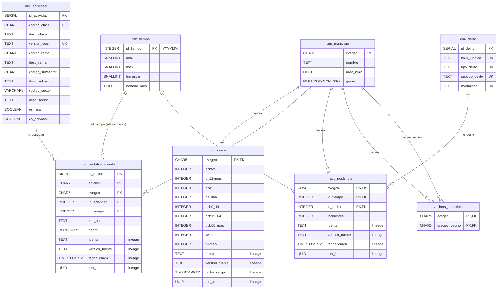

# Warehouse model (gold layer)

Star schema of `yucatan_dw.gold`, loaded by `src/silver_to_gold.py` (`sql/gold/gold.sql`).
DDL in `sql/init.sql`. Static image: [`warehouse_model.png`](warehouse_model.png)
(source: [`warehouse_model.dot`](warehouse_model.dot)). Column details:
[`data_dictionary_gold.md`](data_dictionary_gold.md).

## Grain

| Table | Type | Grain |
| --- | --- | --- |
| `dim_municipio` | dimension | one municipality (106) |
| `dim_tiempo` | dimension | year-month, 2020–2025 (72) |
| `dim_actividad` | dimension | SCIAN class × SCIAN version (2018, 2023) |
| `dim_delito` | dimension | legal good × crime type × subtype × modality |
| `fact_censo` | fact | municipality (Census 2020) |
| `fact_establecimiento` | fact (periodic snapshot) | establishment × DENUE edition — **do not sum across editions** |
| `fact_incidencia` | fact | municipality × month × crime |
| `vecinos_municipio` | bridge | pair of contiguous municipalities (Queen), stored in both directions |

The views `kpi_municipio_anio` and `cociente_localizacion` and the `resultado_*` tables
are derived from this model and are documented in the gold data dictionary.
